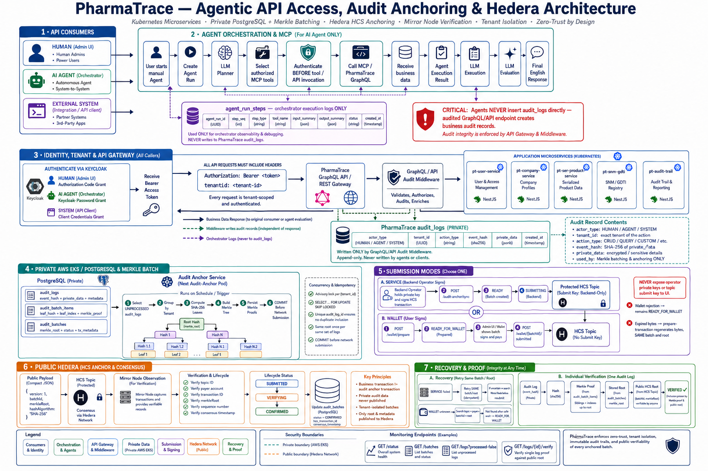

# Audit Anchor Service

NestJS service that anchors audit-log integrity to Hedera Consensus Service (HCS). Original audit records, leaf hashes, and Merkle proofs remain in PostgreSQL. HCS stores only the batch identifier and Merkle root.



## End-to-end flow

```text
Audit event is written to PostgreSQL
        ↓
UI requests unprocessed logs
        ↓
Backend prepares and commits a batch, leaves, proofs, root, and unsigned HCS bytes
        ↓
Connected UI wallet signs, pays, and submits the HCS transaction
        ↓
UI reports the actual Hedera transaction details
        ↓
Backend checks Mirror Node and marks the batch CONFIRMED
```

For wallet-only operation, the backend never signs or submits the HCS transaction.

## What is anchored

Each batch publishes a small HCS message containing:

- `version`
- `batchId`
- `merkleRoot`
- `hashAlgorithm`
- `eventCount` when supplied by the preparation flow

The private audit payload, `private_data`, leaf hashes, and Merkle proofs are not published to HCS. They stay in PostgreSQL and are used for later verification.

## Runtime modes

| Mode | Who submits HCS | Use |
| --- | --- | --- |
| `manual` | Connected UI wallet | Wallet-only operation and testing |
| `service` | Backend operator account | Automated service submission |
| `both` | Backend and UI wallet paths | Migration or mixed operation |

For the current UI-wallet flow, use `ANCHOR_MODE=manual`.

## Wallet-only configuration

| Setting | Purpose |
| --- | --- |
| `DATABASE_URL` | PostgreSQL connection |
| `ANCHOR_MODE=manual` | Prevents automatic service-wallet submission |
| `PLATFORM_ADMIN_API_KEY` | Temporary protection for audit-anchor APIs |
| `HEDERA_NETWORK` | `testnet` or `mainnet` |
| `HEDERA_TOPIC_ID` | HCS topic used for Merkle-root messages |
| `MIRROR_NODE_URL` | Mirror Node used for verification |
| `SUBMISSION_UNKNOWN_WAIT_MS` | Safe wait before retrying an uncertain submission |
| `SUBMITTING_STALE_AFTER_MS` | Age after which a stale submission is reconciled |
| `MIRROR_SEARCH_MAX_PAGES` | Maximum Mirror Node pages searched during recovery |

Do not put these in the deployed wallet-only runtime Secret:

- `HEDERA_OPERATOR_ID`
- `HEDERA_OPERATOR_KEY`
- `HEDERA_TOPIC_SUBMIT_KEY`

They are only needed locally by the topic-creation script. If the HCS topic has a separate submit key, the wallet must also control that key; the simplest wallet-only setup is a topic without a submit key.

Never put comments or replacement text inside an environment value. Rotate any database password, admin key, or private key exposed in a terminal, README, chat, or image.

## Local setup

1. Install dependencies.
2. Copy `.env.example` to `.env`.
3. Set PostgreSQL, HCS topic, Mirror Node, and admin-key values.
4. Run the database migration.
5. Start the NestJS service.

The default local service listens on port `3000`. The database must contain the audit-anchor tables before the service starts processing logs.

For a new HCS topic, run the topic-creation script locally with the operator account and key, save the returned topic ID, and then remove the operator values from the deployed runtime configuration.

## API flow for the UI

All paths below are relative to `/api/v1`. The current development deployment protects them with `x-platform-admin-key`.

### 1. Read logs

`GET /audit-anchor/logs`

Use `tenantId`, `processed=false`, `limit`, and `offset` to load a page of logs. The UI should display only the required summary fields. `private_data` is intentionally omitted from list responses; request one log by ID when full detail is needed.

Useful filters include `actorType`, `actionType`, `status`, and `batchStatus` where enabled by the deployed API.

Pagination is backend pagination. The UI must send the requested `limit` and `offset` and use returned total/page metadata when available; it must not download all logs and paginate locally.

### 2. Prepare a wallet batch

`POST /audit-anchor/wallet/prepare`

Send:

- `payerAccountId`: Hedera account controlled by the connected wallet
- `tenantId`: tenant to process
- `maxEvents`: maximum events to include

The backend selects unprocessed logs, creates the batch, stores every batch item, leaf hash, proof, and Merkle root, commits PostgreSQL, and prepares unsigned HCS transaction bytes.

The response includes `batchId`, `tenantId`, `status=READY_FOR_WALLET`, `eventCount`, `merkleRoot`, `topicId`, `payerAccountId`, `transactionId`, `transactionBytes` as Base64, and `logs` with leaf details.

The UI needs `transactionBytes` for submission. The returned logs are for batch details and proof inspection.

### 3. Sign and submit in the wallet

The UI decodes `transactionBytes`, reconstructs the Hedera transaction with the Hedera SDK or wallet connector, and asks the connected wallet to sign and execute it.

The HCS payload is created by the backend before signing. The UI must not rebuild the Merkle root or replace the HCS payload. The wallet signs and pays; it does not generate the audit data.

The selected wallet account must match `payerAccountId`. An account mismatch, unsupported wallet method, or topic submit-key restriction can cause submission failure.

The transaction ID returned by the wallet is the authoritative submission result. The prepared transaction ID is only the ID of the frozen transaction and may differ when fresh bytes are generated.

### 4. Report the wallet submission

`POST /audit-anchor/wallet/{batchId}/submitted`

Send the actual values returned by the wallet or Mirror Node:

- `transactionId`
- `topicId`
- `sequenceNumber`
- `consensusTimestamp`

Do not send empty strings as confirmed values. If the wallet connector does not return sequence or consensus data, send the transaction ID and topic ID only when the deployed endpoint supports that fallback; reconciliation can obtain missing values from Mirror Node.

The callback acknowledges that the batch entered verification. It does not itself prove HCS consensus.

## Batch lifecycle

```text
UNPROCESSED → READY_FOR_WALLET → SUBMITTED / WAITING_FOR_CONFIRMATION
            → VERIFYING → CONFIRMED
```

Failure and recovery states:

- `SUBMISSION_FAILED`: wallet or service submission failed; retry the same batch when appropriate.
- `SUBMISSION_UNKNOWN`: submission result is uncertain; search Mirror Node before submitting again.
- `VERIFICATION_FAILED`: a message was found but did not match the expected batch/root.
- `READY_FOR_WALLET`: the user can submit the existing batch again; do not create a second batch for the same logs.

`SUBMITTED` or `WAITING_FOR_CONFIRMATION` means PostgreSQL has accepted a submission record, but Mirror Node has not yet confirmed the matching HCS message. It is not a failure by itself.

## Verification

The service verifies:

1. The audit event hash equals the stored leaf hash.
2. The leaf and proof calculate the stored Merkle root.
3. Mirror Node finds the HCS message for the configured topic.
4. The decoded HCS message contains the expected `batchId` and `merkleRoot`.
5. The transaction succeeded and the payer/topic match the stored batch.
6. Sequence number and consensus timestamp are stored.

`GET /audit-anchor/logs/{auditLogId}/verify` returns `eventHashMatchesLeaf`, `merkleProofValid`, `hederaAnchorValid`, `mirrorStatus`, `consensusTimestamp`, `batchStatus`, and `verified`.

`FOUND` plus `verified=true` means the complete proof and public anchor match. `NOT_FOUND` means the configured search did not find a matching message; check the topic, batch ID, root, payer, transaction ID, and deployed configuration.

Wallet/SDK transaction IDs commonly use `account@seconds.nanos`; Mirror Node REST lookup commonly uses `account-seconds-nanos`. Verification must normalize these representations and must not compare a stale prepared ID with the actual wallet submission ID.

## Main API reference

| Method | Path | Purpose |
| --- | --- | --- |
| `GET` | `/audit-anchor/logs` | Paginated audit-log list and filters |
| `GET` | `/audit-anchor/logs/{auditLogId}` | Full audit-log detail |
| `GET` | `/audit-anchor/logs/{auditLogId}/verify` | Verify one leaf and its public HCS anchor |
| `GET` | `/audit-anchor/batches` | List batches and statuses |
| `GET` | `/audit-anchor/batches/{batchId}` | Read one batch and prepared details |
| `POST` | `/audit-anchor/wallet/prepare` | Create and prepare a wallet batch |
| `POST` | `/audit-anchor/wallet/{batchId}/prepare-transaction` | Refresh bytes for the same batch/root |
| `POST` | `/audit-anchor/wallet/{batchId}/submitted` | Record wallet submission details |
| `POST` | `/audit-anchor/batches/{batchId}/verify` | Start or request batch verification |
| `POST` | `/audit-anchor/batches/{batchId}/retry` | Recover an existing failed/uncertain batch |
| `GET` | `/audit-anchor/status` | Service counters and monitoring status |
| `POST` | `/audit-anchor/sync` | Automatic/service-wallet synchronization; avoid in manual mode |
| `GET` | `/audit-anchor/sync/{jobId}` | Poll a synchronization job |

## Failed batches and resubmission

Use the batch retry endpoint for a batch that already owns its logs. Do not call `/sync` to recreate it and do not delete batch items. Retrying preserves the batch ID, event membership, leaf hashes, proofs, and Merkle root.

Before retrying `SUBMISSION_UNKNOWN`, search Mirror Node. Hedera may have accepted the transaction even when the browser lost the callback. A `CONFIRMED` batch must never be rebuilt or resubmitted.

## Audit events from other UI actions

Lot status changes and recall transactions are separate business operations from audit anchoring:

```text
UI wallet submits lot-status or recall transaction
        ↓
Core application stores the returned Hedera metadata
        ↓
Core application writes an audit_logs record
        ↓
Audit Anchor batches that record and anchors its hash
```

The audit-anchor service cannot infer a business audit event from a Hedera transaction. The core application must write an authenticated audit-log record after the business transaction succeeds. Recommended action types include `LOT_STATUS_CHANGED` and `LOT_RECALL_PUSHED`.

Do not write audit rows directly from the browser. Use the application audit API or a protected backend ingestion path so tenant, actor, hash, and event timestamps are assigned consistently.

## Database and concurrency guarantees

- Batch data is committed before Hedera submission.
- Every selected audit log is assigned to at most one batch.
- Batch items retain leaf indexes, hashes, and proofs for later verification.
- PostgreSQL locking prevents overlapping workers from selecting the same logs.
- Failed submission does not put already-assigned logs back into the unprocessed pool.
- A retry uses the same root and proofs.
- `CONFIRMED` batches are immutable from the anchoring workflow perspective.

## Troubleshooting

| Symptom | Check |
| --- | --- |
| `transactionBytes` is empty | Use the prepare or batch-detail response from the deployed backend and verify the wallet transaction-byte migration exists. |
| Callback returns HTTP 400 | The request contains missing or empty required fields; log the wallet result before calling the callback. |
| Wallet asks for a private key | The UI is using an external-account flow or the selected wallet account does not control the payer account. |
| Snap says method not found | Use the wallet connector method supported by the installed Hedera Snap. |
| `WAITING_FOR_CONFIRMATION` | The batch was submitted locally and is awaiting Mirror Node reconciliation. |
| `NOT_FOUND` from verify | Check topic, batch ID, root, payer, exact wallet transaction ID, Mirror Node URL, and search-page configuration. |
| Mirror Node shows a message but app does not | Confirm the deployed backend has transaction-ID normalization/fallback logic and run verification again. |
| Raw payload is empty | List endpoints omit private payloads; load the individual log-detail endpoint. |
| Logs are missing from a list page | Use backend `limit` and `offset`; check tenant and status filters and the returned total. |
| A failed batch has no transaction ID | The wallet callback did not return or persist the actual transaction ID. Search Mirror Node before retrying. |

## Deployment checklist

1. Apply database migrations before starting the new image.
2. Configure `ANCHOR_MODE=manual` and wallet-safe HCS settings.
3. Keep operator credentials out of the runtime Secret in wallet-only mode.
4. Deploy with `helm upgrade --install` so the Service and ClusterIP are preserved.
5. Confirm the pod is ready and the expected routes are registered.
6. Prepare one small batch, submit it from the UI, and verify it through Mirror Node.
7. Check for `CONFIRMED`, a consensus timestamp, and no error.
8. Test wallet rejection, expired bytes, uncertain callback, Mirror Node delay, and retry behavior.

For production, replace the temporary platform-admin header with JWT/Keycloak authorization, store secrets in a protected secret manager, rotate exposed development credentials, and enforce tenant isolation from the authenticated identity.

## Related documentation

- [API connection notes](./docs/api-connect-for-log.md)
- [API reference](./api.doc.md)
- [Topic creation script](./scripts/create-hedera-topic.ts)
- [Agent orchestrator README](./pharmatrace-agent-orchestrator/README.md)
